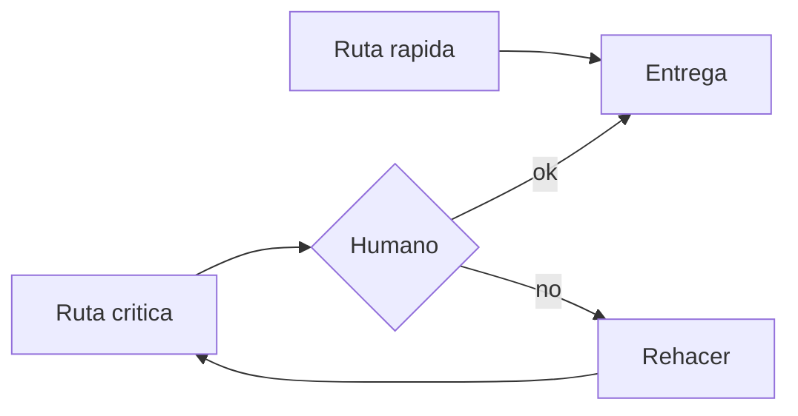

# Software Factory

---

---

---

---

---

### Gates

```mermaid
flowchart LR
  A[Ruta rapida] --> OK[Entrega]
  B[Ruta critica] --> H{Humano}
  H -->|ok| OK
  H -->|no| R[Rehacer]
  R --> B
```

---

**Idea:** dejar de chatear → orquestar.
