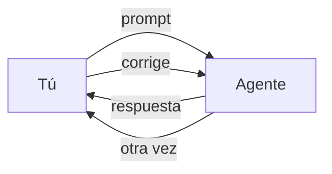
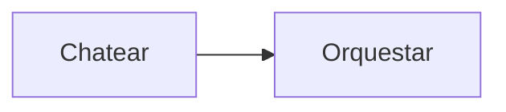
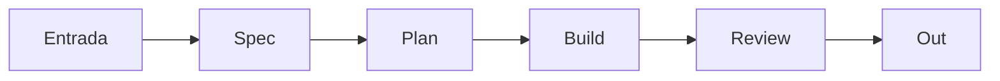
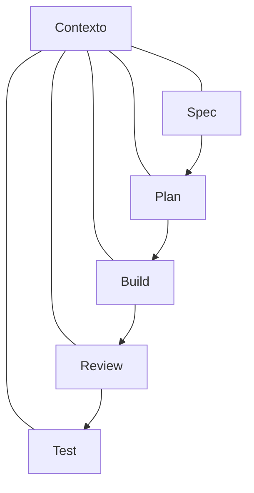
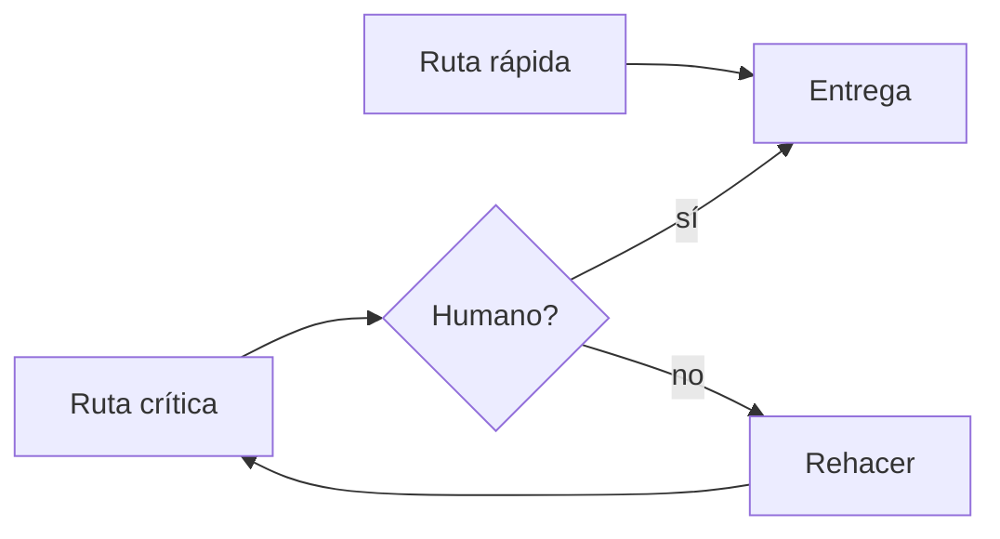

# Software Factory — la idea

No es un chat mejor. Es una **fábrica**.

---

## Hoy

```mermaid
flowchart LR
  U[Tú] -->|prompt| A[Agente]
  A -->|respuesta| U
  U -->|corrige| A
  A -->|otra vez| U
```

---

## El salto

```mermaid
flowchart LR
  A[Chatear] --> B[Orquestar]
```

---

## La fábrica

```mermaid
flowchart LR
  E[Entrada] --> S[Spec]
  S --> P[Plan]
  P --> B[Build]
  B --> R[Review]
  R --> O[Out]
```

---

## Roles

```mermaid
flowchart TB
  C[Contexto]
  C --- SP[Spec]
  C --- PL[Plan]
  C --- DV[Build]
  C --- RV[Review]
  C --- QA[Test]
  SP --> PL --> DV --> RV --> QA
```

---

## Gates

```mermaid
flowchart LR
  Auto[Ruta rápida] --> OK[Entrega]
  Crit[Ruta crítica] --> H{Humano?}
  H -->|sí| OK
  H -->|no| Fix[Rehacer]
  Fix --> Crit
```

---

Poco texto. Solo el modelo.
